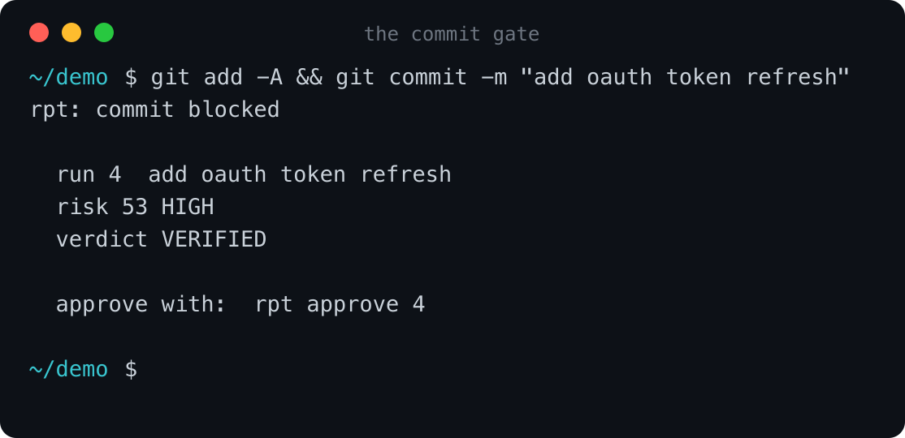
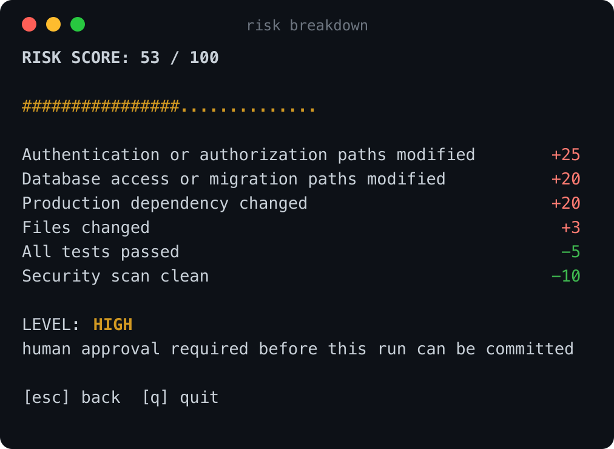
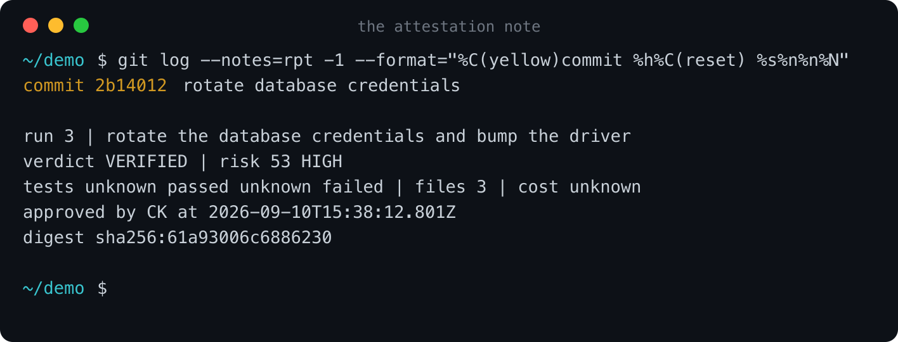
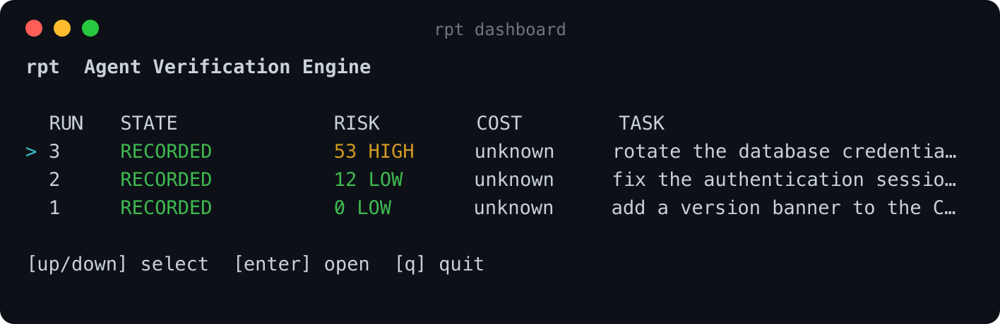
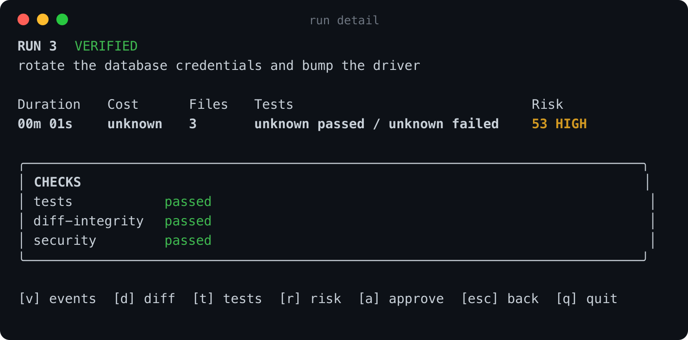

# rpt

**An AI coding agent grades its own homework. rpt is the second opinion.**

An agent says "I fixed the bug, 184 tests pass, 7 files changed." That sentence
is produced by the same system that made the change. Nothing outside the agent
confirms any of it.

rpt watches a Claude Code session from the outside, re-derives the facts itself
by asking git and by running your tests, scores how risky the change is, and
stops the commit when a human should look. Then it staples the verdict to the
commit as a git note, so the record travels with the code.

It never takes the agent's word for anything. Claims and observations are kept
apart on purpose.

---

## It stops a commit that needs you

Your normal `git commit`. No new command to remember.



## It shows its work

Every rule that moved the score, with its weight. The number is never a black box.



## It leaves a receipt on the commit

Attached as a git note, reviewable in a pull request. It says plainly whether a
human approved, whether the gate was bypassed, or whether nobody was needed.



## It gives you a console

Run `rpt` on a terminal. Arrow keys, Enter to open, then `v` events, `d` diff,
`t` tests, `r` risk, `a` approve.





---

## Use it

Requires Node 22 and a git repository.

```bash
git clone https://github.com/KlyneChrysler/rpt.git
cd rpt && pnpm install && pnpm build && npm link
```

Then once per repository you want watched:

```bash
cd ~/your-project
rpt init
```

Open `rpt.config.json` and give it your test command. This is the setting that
decides whether rpt can tell you anything:

```json
{
  "testCommand": "pnpm test",
  "coverageCommand": "pnpm test -- --coverage"
}
```

Now work with Claude Code exactly as before. rpt records the session, verifies
it when you commit, and stays out of the way unless something needs you.

```bash
rpt                  # the console
rpt runs             # every run
rpt risk 3           # why a run scored what it did
rpt diff 3           # what rpt observed, not what the agent claimed
rpt approve 3        # human only, terminal required
rpt doctor           # when something feels wrong
git log --notes=rpt  # the receipts
```

## Two things to know up front

**A skip is not a pass.** If a check could not run, rpt does not know, and not
knowing means you decide. With no `coverageCommand` the coverage check skips and
every commit will ask for you. Give it one, or set
`"verifiers": { "testQuality": "off" }` to drop that check from the verdict.

**The agent cannot clear itself.** `rpt approve` refuses inside a Claude Code
session, requires a terminal, and asks you to type a phrase naming the run, the
verdict and the risk level. The slash command plugin exposes reads only.

| Score | Band | What happens |
|---|---|---|
| 0-20 | LOW | commits |
| 21-50 | MEDIUM | commits, review suggested |
| 51-80 | HIGH | needs your approval |
| 81-100 | CRITICAL | blocked, no approval path |

`RPT_BYPASS=1 git commit` skips the gate for everything except CRITICAL, and the
receipt on that commit says `BYPASSED`.

## More

- [Using rpt](docs/usage.md) — every command, what gets recorded, how to recover
- [What rpt does not establish](docs/limits.md) — read before trusting a green verdict
- [Threat model](docs/threat-model.md) — what it defends against, and what it does not

MIT.
